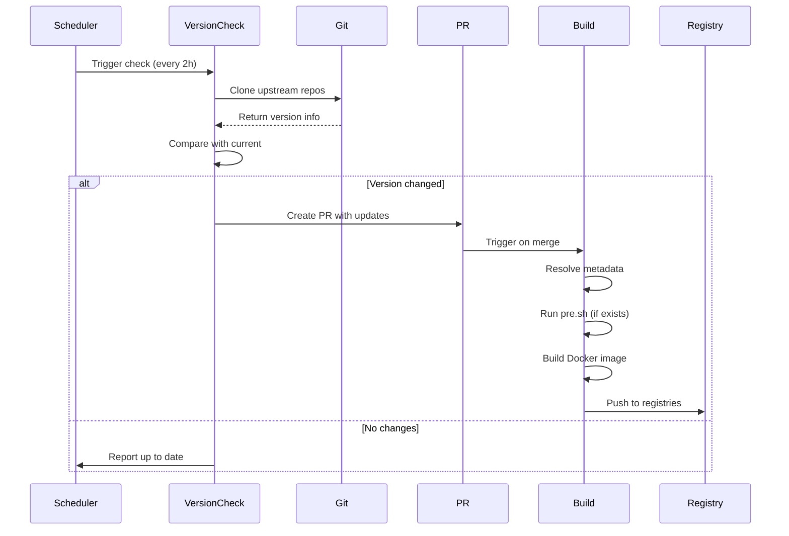

Apps Image is an automated Docker image build and version tracking system that monitors upstream repositories and automatically builds multi-variant Docker images when new versions are detected.

## Architecture Overview

The system consists of three main components working together through GitHub Actions:

```text
┌─────────────────────────────────────────────────────────────┐
│                    GitHub Actions Workflow                  │
├─────────────────────────────────────────────────────────────┤
│                                                             │
│  ┌──────────────┐    ┌──────────────┐    ┌──────────────┐ │
│  │   Check      │───▶│   Resolve    │───▶│    Build     │ │
│  │   Version    │    │   Metadata   │    │    Image     │ │
│  └──────────────┘    └──────────────┘    └──────────────┘ │
│         │                    │                    │         │
└─────────┼────────────────────┼────────────────────┼─────────┘
          │                    │                    │
          ▼                    ▼                    ▼
    ┌──────────┐         ┌──────────┐        ┌──────────┐
    │ meta.json│         │  Docker  │        │  Docker  │
    │  Updated │         │ Metadata │        │   Hub    │
    └──────────┘         └──────────┘        └──────────┘
```

## Core Components

### 1. Version Checking System

The version checking system monitors upstream repositories and detects when new versions are available.

**Location**: `action/src/check.ts`, `action/src/variant.ts`

**Key Classes**:
- `CheckAppsManager` - Orchestrates version checking across all applications
- `CheckAppContext` - Manages version checking for a single application
- `VariantContext` - Handles version detection for individual variants

**Workflow**:

```typescript
// From action/src/check.ts
async function main() {
  // 1. Initialize application manager
  const appsManager = new CheckAppsManager()
  
  // 2. Scan applications
  const appPaths = await appsManager.scanApps()
  
  // 3. Load application contexts
  await appsManager.loadApps(appPaths)
  
  // 4. Execute version checks
  const { allApps, outdatedApps } = await appsManager.checkAllVersions()
  
  // 5. Build PR data for updates
  if (outdatedApps.size > 0) {
    const prResults = await appsManager.buildPrDatas(outdatedApps)
    await appsManager.createPr(prResults)
  }
}
```

**Supported Check Types**:

<AccordionGroup>
  <Accordion title="version - Package Version Tracking">
    Monitors version from package.json or other version files:
    
    ```json
    {
      "checkver": {
        "type": "version",
        "repo": "https://github.com/srcbookdev/srcbook",
        "file": "srcbook/package.json"
      }
    }
    ```
    
    Example: `srcbook` (apps/srcbook/meta.json:12-16)
  </Accordion>

  <Accordion title="sha - Commit Hash Tracking">
    Tracks the latest commit SHA from a repository or specific path:
    
    ```json
    {
      "checkver": {
        "type": "sha",
        "repo": "https://github.com/antfu-collective/icones"
      }
    }
    ```
    
    Example: `icones` (apps/icones/meta.json:12-15)
    
    With path tracking:
    ```json
    {
      "checkver": {
        "type": "sha",
        "repo": "https://github.com/imputnet/cobalt",
        "path": "web"
      }
    }
    ```
    
    Example: `cobalt:dev` variant (apps/cobalt/meta.json:28-32)
  </Accordion>

  <Accordion title="tag - Git Tag Tracking">
    Monitors repository tags with optional pattern matching:
    
    ```json
    {
      "checkver": {
        "type": "tag",
        "repo": "https://github.com/lsky-org/lsky-pro"
      }
    }
    ```
    
    Example: `lsky:latest` (apps/lsky/meta.json:12-15)
    
    The system automatically finds valid semver tags or uses `tagPattern` for custom matching.
  </Accordion>

  <Accordion title="manual - Manual Version Control">
    Requires manual version updates in meta.json:
    
    ```json
    {
      "checkver": {
        "type": "manual"
      }
    }
    ```
    
    Example: `nginx:latest` (base/nginx/meta.json:9-11)
    
    Useful for base images that don't track upstream repositories.
  </Accordion>
</AccordionGroup>

### 2. Metadata Resolution System

Converts application metadata into Docker build configuration.

**Location**: `action/src/metadata.ts`, `action/src/context/metaAppContext.ts`

**Key Responsibilities**:
- Parse variant configurations from meta.json
- Generate Docker image names and tags
- Create build matrices for GitHub Actions
- Process placeholder variables in configurations

**Build Matrix Generation** (action/src/context/metaAppContext.ts:85-180):

```typescript
public async buildMatrixData(variants: Meta['variants'] = {}) {
  // For each variant, generate:
  // - Docker image names (Docker Hub, GHCR, ACR)
  // - Image tags with version placeholders
  // - Labels and metadata
  // - Build arguments and platforms
  
  const matrixData = []
  for (const [variantName, variant] of Object.entries(variants)) {
    const { version, sha } = variant
    
    // Resolve Dockerfile path
    const file = variant.docker?.file || 
      (variantName === 'latest' ? 'Dockerfile' : `Dockerfile.${variantName}`)
    
    // Generate image names
    const images = variant.docker?.images || [
      `aliuq/{{name}}`,
      `ghcr.io/aliuq/{{name}}`
    ]
    
    // Generate tags with placeholders
    const tags = variant.docker?.tags || [
      `type=raw,value=${variantName}`,
      `type=raw,value={{version}}`
    ]
    
    matrixData.push({ variant: variantName, version, sha, ... })
  }
  
  return matrixData
}
```

### 3. Image Building System

Builds and publishes multi-platform Docker images.

**Workflow**: `.github/workflows/build-image.yaml`

**Features**:
- Multi-platform builds (linux/amd64, linux/arm64)
- Pre/post build scripts support
- Automatic registry publishing (Docker Hub, GHCR, ACR)
- Build caching for faster builds

**Pre-build Scripts** (action/src/context/metaAppContext.ts:85):

Applications can define `pre.sh` scripts to run before Docker builds. This is especially useful for pre-building assets:

```bash
# apps/rayso/pre.sh
#!/bin/bash
set -euxo pipefail

VERSION="73fac26"

# Clone the repository
mkdir -p app && cd app
git clone --depth=1 https://github.com/raycast/ray-so . && git checkout $VERSION

# Install and build
mise use bun@latest node@lts -g
bun install --no-cache && bun run build
```

Then the Dockerfile simply copies the pre-built assets:

```dockerfile
# apps/rayso/Dockerfile
FROM node:24-alpine
WORKDIR /app
ENV NODE_ENV=production

COPY ./app/public ./public
COPY ./app/.next/standalone/apps/rayso/app ./
COPY ./app/.next/static ./.next/static

CMD ["node", "server.js"]
```

<Note>
Pre-build scripts are particularly valuable for Next.js and other framework builds on ARM64 platforms, where native builds can be extremely slow.
</Note>

## Automated Workflow

The system runs automatically through three triggers:

### 1. Scheduled Checks

Runs every 2 hours to check for version updates:

```yaml
# .github/workflows/check-version.yaml
on:
  schedule:
    - cron: '0 */2 * * *'  # Every 2 hours
```

### 2. Manual Triggers

Developers can manually trigger checks or builds:

```bash
# Check specific application
workflow_dispatch:
  inputs:
    context: apps/icones
    create_pr: true

# Build specific variant
workflow_dispatch:
  inputs:
    context: apps/icones
    variants: latest,dev
```

### 3. Push Events

Triggered when meta.json or Dockerfile is modified:

```yaml
on:
  push:
    branches:
      - master
    paths:
      - apps/*/meta.json
      - apps/*/Dockerfile
      - apps/*/Dockerfile.*
```

## Data Flow

### Version Check to Build Pipeline



### Repository Structure

Each application follows this structure:

```
apps/
├── icones/
│   ├── meta.json          # Application metadata
│   ├── Dockerfile         # Build configuration for 'latest' variant
│   ├── README.md          # Usage documentation
│   └── pre.sh            # Optional pre-build script
├── lsky/
│   ├── meta.json
│   ├── Dockerfile         # 'latest' variant
│   ├── Dockerfile.dev     # 'dev' variant
│   └── README.md
└── srcbook/
    ├── meta.json
    ├── Dockerfile
    ├── Dockerfile.tls     # 'tls' variant
    └── README.md
```

## Git Repository Management

The version check system clones and caches upstream repositories efficiently:

**Cache Strategy** (action/src/git.ts:29-53):

```typescript
public async cloneOrUpdateRepo(repoUrl: string, options: CloneOptions) {
  const repoPath = path.join(this.cacheDir, repoName)
  
  if (await pathExists(repoPath)) {
    // Repository exists, update it
    await this.updateRepo(repoUrl, repoPath, options)
  } else {
    // Clone new repository
    await this.cloneRepo(repoUrl, repoPath, options)
  }
  
  return repoPath
}
```

**GitHub Actions Cache**:

```yaml
- name: Cache Git repositories
  uses: actions/cache@v4
  with:
    path: .git-cache
    key: git-repos-${{ hashFiles('**/meta.json') }}
    restore-keys: |
      git-repos-
```

<Tip>
The cache key uses a hash of all meta.json files, ensuring cache invalidation when repositories change while preserving efficiency.
</Tip>

## Error Handling and Recovery

The system includes robust error handling:

- **Shallow to Full Clone Conversion**: Automatically converts shallow clones when needed (action/src/git.ts:130-140)
- **Detached HEAD Recovery**: Re-clones repositories if updates fail on detached HEAD (action/src/git.ts:106-113)
- **Variant Validation**: Skips variants missing required version or SHA data (action/src/context/metaAppContext.ts:99-105)
- **File Existence Checks**: Validates Dockerfile existence before adding to build matrix (action/src/context/metaAppContext.ts:113-117)

## Summary

The Apps Image architecture provides:

- **Automated Version Tracking**: Continuously monitors upstream repositories
- **Multi-Variant Support**: Build multiple image variants from single source
- **Efficient Caching**: Minimizes network and compute resources
- **Flexible Build System**: Supports pre-build scripts and custom configurations
- **Automatic Publishing**: Pushes to multiple registries simultaneously

This architecture enables maintaining dozens of Docker images with minimal manual intervention, ensuring they stay up-to-date with upstream changes.